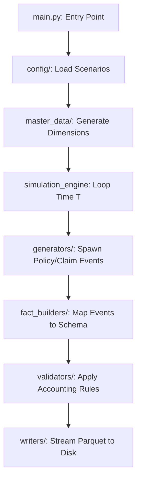

# Synthetic Actuarial Insurance Engine

An enterprise-grade, event-driven synthetic data generator that simulates realistic Property & Casualty (P&C) insurance portfolios. It produces a fully self-balancing double-entry accounting ledger of policies, billing schedules, endorsements, and claims.

## Quick Start

### 1. Requirements
- Python 3.10+
- `pip install -r requirements.txt`

### 2. Generate Data
```bash
# Generate the dataset using production constraints
python main.py --scenario prod
```
The engine will output Parquet files into the `output/run_<timestamp>/parquet/` directory, containing millions of rows of actuarially realistic fact events.

---

## High-Level Code Flow

The application executes in a deterministic pipeline, streaming data directly to disk to minimize memory usage:



## Directory Structure
To help you navigate the codebase, here is the functional layout:

- `main.py`: The entry point that orchestrates the simulation timeline.
- `config/`: Contains all YAML files controlling data scale, frequencies, and actuarial parameters.
- `generators/`: Contains the stochastical generation logic (e.g., `policy_generator.py`, `claim_generator.py`).
- `fact_builders/`: Transforms the raw generated events into the strict database schema layout (`policy_transaction_event_builder.py`).
- `master_data/`: Maintains the state of dimensions like `Dim_Customer` and `Dim_Policy` across time steps.
- `validators/`: Ensures no mathematical impossibilities exist (e.g., paid claims exceeding incurred claims).
- `writers/`: Implements PyArrow chunking to write massive datasets to `.parquet` without crashing RAM.
- `docs/`: The comprehensive developer and business documentation suite.

---

## Documentation Index

The documentation is split into targeted guides to serve different stakeholders:
1. **[Business Context & Features](docs/1_Business_Context_&_Features.md)**
   Explains the domain lifecycle (Quote -> Bind -> Claim -> Renewal), policy timeline views, and catastrophic math.
2. **[Data Dictionary & Schema](docs/2_Data_Dictionary_&_Schema.md)**
   The absolute source of truth for the Parquet outputs, complete with ER Diagrams and example SQL queries.
3. **[Technical Architecture](docs/3_Technical_Architecture.md)**
   A "How-To" guide explaining PyArrow streaming, the internal execution pipeline, and how to add new events.
4. **[Configuration Tuning Guide](docs/4_Configuration_Tuning_Guide.md)**
   A scenario-based guide explaining how to shift data scales or adjust claim frequencies via YAMLs.
5. **[HCA Knowledge Model](docs/5_HCA_Knowledge_Model.md)**
   Explains how the synthetic data connects to the Hila Conversational Analytics (HCA) package using double-entry accounting.
