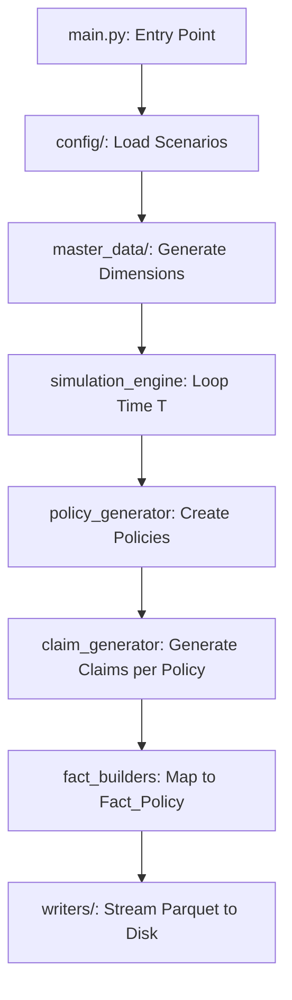

# Synthetic Claim-Level Insurance Generator

A synthetic data generator that simulates a Property & Casualty (P&C) insurance portfolio mapped to a strict **Claim-Level Star Schema**. This engine is optimized for generating baseline claims severity models, policy distribution mapping, and simple premium-to-loss aggregations.

## Quick Start

### 1. Requirements
- Python 3.10+
- `pip install -r requirements.txt`

### 2. Generate Data
```bash
# Generate the dataset using production constraints
python main.py --scenario prod
```

The engine will output CSV and Parquet files into the `output/run_<timestamp>/` directory, adhering strictly to the 1-row-per-claim schema rules.

---

## High-Level Code Flow

The application executes in a deterministic pipeline, mapping generated policies directly to simulated claims:



## Directory Structure
- `main.py`: The entry point that orchestrates the simulation timeline.
- `config/`: Contains all YAML files controlling data scale, frequencies, and actuarial parameters.
- `generators/`: Contains the logic for spawning policies and claims.
- `fact_builders/`: Transforms the raw generated entities into the strict database schema layout.
- `master_data/`: Maintains the state of dimensions like `Dim_Customer` and `Dim_Policy`.
- `writers/`: Implements PyArrow chunking to write massive datasets to `.parquet` without crashing RAM.
- `docs/`: The comprehensive documentation suite.

---

## Documentation Index

The documentation is split into targeted guides:

1. **[Business Context](docs/1_Business_Context.md)**
   Explains the actuarial rules of the Claim-Level model, including the 30% zero-claim baseline and duplicate premium handling.
2. **[Data Dictionary & Schema](docs/2_Data_Dictionary_&_Schema.md)**
   The source of truth for the outputs, complete with ER Diagrams and example SQL queries for calculating Loss Ratios on a claim-level grain.
3. **[Technical Architecture](docs/3_Technical_Architecture.md)**
   Explains PyArrow streaming and the Python generation loop.
4. **[Configuration Tuning Guide](docs/4_Configuration_Tuning_Guide.md)**
   A scenario-based guide explaining how to shift data scales or adjust claim frequencies via YAMLs.
