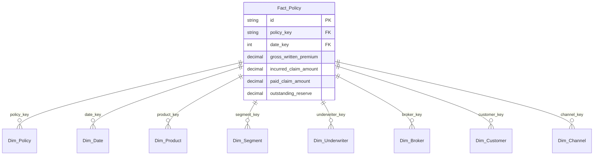

# Data Dictionary & Schema Guide

This document is the absolute source of truth for the Parquet outputs generated by the synthetic engine. It provides the structural definitions required to write SQL queries against the dataset.

## Entity Relationship Diagram
The dataset follows a standard Star Schema optimized for Claim-Level analysis.



---

## 1. `Fact_Policy`
**Grain**: 1 row = 1 claim. (A 0-claim policy has 1 row with $0 claim financials).

| Column | Type | Description |
|--------|------|-------------|
| `id` | STRING | Unique ID for the row. |
| `policy_key` | STRING | FK to `Dim_Policy`. |
| `date_key` | INT | YYYYMMDD integer. Represents the claim occurrence date. |
| `product_key` | STRING | FK to `Dim_Product`. |
| `segment_key` | STRING | FK to `Dim_Segment`. |
| `underwriter_key` | STRING | FK to `Dim_Underwriter`. |
| `broker_key` | STRING | FK to `Dim_Broker` (NULL if Channel is Direct). |
| `customer_key` | STRING | FK to `Dim_Customer`. |
| `channel_key` | STRING | FK to `Dim_Channel`. |
| `gross_written_premium`| DECIMAL | Total premium booked for the policy term. |
| `ibnr_amount` | DECIMAL | Incurred but not reported amount. |
| `recoveries_amount` | DECIMAL | Recoveries collected. |
| `ceded_premium` | DECIMAL | Premium ceded to reinsurance. |
| `reinsurance_recovery` | DECIMAL | Amount recovered from reinsurance. |
| `net_earned_premium` | DECIMAL | Premium earned over the term. |
| `incurred_claim_amount`| DECIMAL | Liability/Loss recognized. |
| `paid_claim_amount` | DECIMAL | Cash outflow for the claim. |
| `outstanding_reserve` | DECIMAL | Liability remaining to be paid. |
| `operating_expense` | DECIMAL | Administrative expenses. |
| `acquisition_expense` | DECIMAL | Commission/Acquisition cost. |
| `new_policy_flag` | BOOLEAN | True if this is the first term of the policy. |
| `renewal_flag` | BOOLEAN | True if the event applies to a renewal term. |

---

## 2. Example SQL Queries

> [!WARNING]
> **Prevent Double Counting**: Because `gross_written_premium` is repeated on every row for a policy, you must deduplicate by `policy_key` before summing it!

### Query 1: Total Gross Written Premium (GWP) by Product
```sql
SELECT 
    p.product_name,
    SUM(deduped_premiums.gwp) AS total_gwp
FROM (
    SELECT DISTINCT policy_key, product_key, gross_written_premium AS gwp
    FROM Fact_Policy
) deduped_premiums
JOIN Dim_Product p ON deduped_premiums.product_key = p.product_key
GROUP BY p.product_name
ORDER BY total_gwp DESC;
```

### Query 2: Claim Severity (Average Incurred Cost per Claim)
```sql
SELECT 
    p.product_name,
    AVG(f.incurred_claim_amount) AS avg_claim_severity
FROM Fact_Policy f
JOIN Dim_Product p ON f.product_key = p.product_key
WHERE f.incurred_claim_amount > 0 -- Exclude the 0-claim placeholder rows
GROUP BY p.product_name
ORDER BY avg_claim_severity DESC;
```
