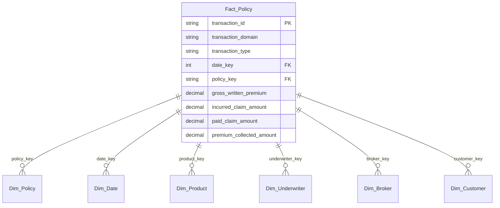

# Data Dictionary & Schema Guide

This document is the absolute source of truth for the Parquet outputs generated by the synthetic engine. It provides the structural definitions required to write SQL queries against the dataset.

## Entity Relationship Diagram
The dataset follows a standard Star Schema optimized for event-grain time-series analysis.



---

## 1. `Fact_Policy`
**Grain**: 1 row = 1 transaction event. A single policy will have dozens of rows.

| Column | Type | Description |
|--------|------|-------------|
| `transaction_id` | STRING | Unique ID for the event. |
| `transaction_domain` | STRING | `Underwriting`, `Billing`, `Claims`, `Reinsurance`, `Policy Servicing`. |
| `transaction_type` | STRING | Specific event name (e.g. `Premium Collected`, `Claim Reported`, `Policy Bound`). |
| `policy_key` | STRING | FK to `Dim_Policy`. |
| `date_key` | INT | YYYYMMDD integer for the event date. Joins to `Dim_Date.date_key`. |
| `policy_issue_date` | STRING | Date the policy was officially issued. |
| `product_key` | STRING | FK to `Dim_Product`. |
| `segment_key` | STRING | FK to `Dim_Segment`. |
| `underwriter_key` | STRING | FK to `Dim_Underwriter`. |
| `broker_key` | STRING | FK to `Dim_Broker` (NULL if Channel is Direct). |
| `customer_key` | STRING | FK to `Dim_Customer`. |
| `channel_key` | STRING | FK to `Dim_Channel`. |
| `claim_key` | STRING | Key for claim events. NULL for underwriting/billing. |
| `pricing_decision_type`| STRING | `Automated` vs `Manual`. |
| `gross_written_premium`| DECIMAL | Premium booked (Positive on Bind, Negative on Decrease). |
| `premium_collected_amount`| DECIMAL | Cash premium physically received. |
| `ibnr_amount` | DECIMAL | Incurred but not reported reserve amount. |
| `recoveries_amount` | DECIMAL | Recoveries collected. |
| `ceded_premium` | DECIMAL | Premium ceded to reinsurance. |
| `reinsurance_recovery` | DECIMAL | Amount recovered from reinsurance. |
| `incurred_claim_amount`| DECIMAL | Liability/Loss recognized. |
| `paid_claim_amount` | DECIMAL | Cash outflow for a claim. |
| `renewal_flag` | BOOLEAN | True if the event applies to a renewal term. |

---

## 2. Example SQL Queries

> [!WARNING]
> **Handling NULLs**: Financial columns use `NULL` (not `0.0`) when an event does not have an associated dollar amount. You MUST use `COALESCE(column, 0)` in arithmetic.
> **Prevent Double Counting**: Never run `SUM(gross_written_premium)` without filtering to specific `transaction_type`s (like `Policy Bound`), otherwise you will double-count premium across collection/claim rows!

### Query 1: Total Gross Written Premium (GWP) by Product
```sql
SELECT 
    p.product_name,
    SUM(f.gross_written_premium) AS total_gwp
FROM Fact_Policy f
JOIN Dim_Product p ON f.product_key = p.product_key
WHERE f.transaction_type IN ('Policy Bound', 'Renewal Policy Bound', 'Endorsement')
GROUP BY p.product_name
ORDER BY total_gwp DESC;
```

### Query 2: Ultimate Loss Ratio
```sql
SELECT 
    d.year,
    SUM(f.incurred_claim_amount) AS total_incurred,
    SUM(f.premium_collected_amount) AS total_earned,
    SUM(f.incurred_claim_amount) / NULLIF(SUM(f.premium_collected_amount), 0) AS loss_ratio
FROM Fact_Policy f
JOIN Dim_Date d ON f.date_key = d.date_key
GROUP BY d.year
ORDER BY d.year;
```

### Query 3: Active Policy Count at End of Year
```sql
SELECT 
    COUNT(DISTINCT f.policy_key) AS active_policies
FROM Fact_Policy f
JOIN Dim_Date d ON f.date_key = d.date_key
JOIN Dim_Policy dp ON f.policy_key = dp.policy_key
WHERE d.year = 2024
  AND dp.policy_start_date <= '2024-12-31'
  AND (dp.policy_lapsed_date IS NULL OR dp.policy_lapsed_date > '2024-12-31')
  AND dp.policy_end_date >= '2024-12-31';
```
